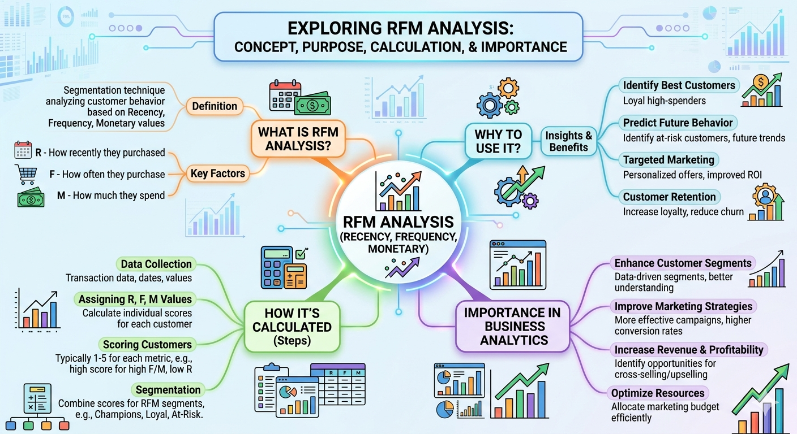

# 📊 Customer Segmentation using RFM Analysis (Power BI)

## 🚀 Project Overview

This project focuses on **customer segmentation using RFM (Recency, Frequency, Monetary) analysis** to identify valuable customers and understand purchasing behavior.

The dashboard is built using **Power BI**, providing interactive insights into different customer segments such as Champions, Loyal Customers, At Risk customers, etc.

---

## 🧠 What is RFM Analysis?

RFM stands for:

* **Recency (R)** → How recently a customer made a purchase
* **Frequency (F)** → How often a customer makes purchases
* **Monetary (M)** → How much money a customer spends

**Visualization**

   * Built interactive Power BI dashboard:

     * Customer count by segment
     * KPI cards (Total Customers)
     * Segment distribution charts
     * Customer-level table

---

## 📊 Dashboard Features

* 📌 Total Customer KPI
* 📌 Segment-wise Customer Distribution
* 📌 Interactive Filters (Segment-wise analysis)
* 📌 Customer-level details (R, F, M scores)

---

## 🛠️ Tools & Technologies

* **Power BI**
* **DAX (Data Analysis Expressions)**
* **Excel / CSV Dataset**

---

## 💡 Key Insights (Example)

* Majority of customers fall under **“Can't Lose Them”** and **“Champion”** segments
* A small portion of customers are **At Risk or Hibernating**, indicating churn potential
* Targeted strategies can significantly improve retention and revenue

---

## 🚀 Future Improvements

* Integrate **real-time data pipeline**
* Add **predictive modeling (churn prediction)**
* Deploy as a **web-based analytics dashboard**

---

## 📌 Conclusion

RFM analysis is a powerful and simple technique to understand customer behavior.
This project demonstrates how businesses can leverage data analytics to:

* Improve customer engagement
* Increase profitability
* Make smarter marketing decisions

---

## 🙌 Author

**Arin Ganguly**
🔗 LinkedIn: linkedin.com/in/arin-ganguly

---
