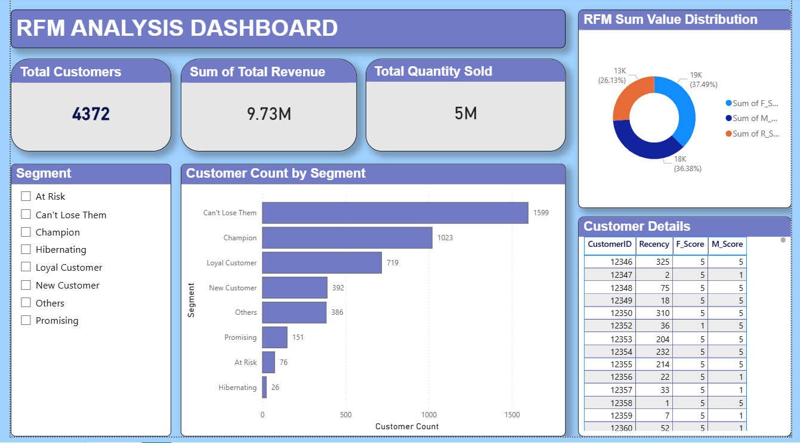

# 📊 Customer Segmentation using RFM Analysis (Power BI)

## 🚀 Project Overview

This project focuses on **customer segmentation using RFM (Recency, Frequency, Monetary) analysis** to identify valuable customers and understand purchasing behavior.

The dashboard is built using **Power BI**, providing interactive insights into different customer segments such as Champions, Loyal Customers, At Risk customers, etc.

---

## 🧠 What is RFM Analysis?

RFM stands for:

* **Recency (R)** → How recently a customer made a purchase
* **Frequency (F)** → How often a customer makes purchases
* **Monetary (M)** → How much money a customer spends

Each customer is scored (typically from 1 to 5) for each of these factors.

👉 Example:

* R = 5 → Very recent purchase
* F = 5 → Frequent buyer
* M = 5 → High spender

These scores are combined to segment customers into meaningful groups.

---

## 🎯 Why RFM Analysis is Important

RFM analysis is widely used in **business analytics, marketing, and CRM** because:

### ✅ 1. Identifies High-Value Customers

Helps businesses find **top customers (Champions)** who contribute the most revenue.

### ✅ 2. Improves Customer Retention

Detects **At Risk** and **Hibernating** customers, allowing timely re-engagement strategies.

### ✅ 3. Enables Targeted Marketing

Different segments can be targeted with different campaigns:

* Champions → Loyalty rewards
* New Customers → Onboarding offers
* At Risk → Discounts or reminders

### ✅ 4. Increases Revenue

By focusing on the right customer groups, companies can:

* Upsell
* Cross-sell
* Reduce churn

### ✅ 5. Data-Driven Decision Making

Transforms raw transaction data into **actionable insights**.

---

## 📂 Dataset Description

The dataset contains customer transaction data with the following key fields:

* CustomerID
* Recency (days since last purchase)
* Frequency (number of purchases)
* Monetary (total spend)

---

## ⚙️ Methodology

1. **Data Cleaning & Preparation**

   * Processed raw transaction data
   * Calculated Recency, Frequency, Monetary values

2. **Scoring**

   * Assigned scores (1–5) to R, F, M based on quantiles

3. **Segmentation**

   * Created segments using DAX logic:

     * Champion
     * Loyal Customer
     * Potential Loyalist
     * New Customer
     * At Risk
     * Hibernating
     * etc.

4. **Visualization**

   * Built interactive Power BI dashboard:

     * Customer count by segment
     * KPI cards (Total Customers)
     * Segment distribution charts
     * Customer-level table

---

## 📊 Dashboard Features

* 📌 Total Customer KPI
* 📌 Segment-wise Customer Distribution
* 📌 Interactive Filters (Segment-wise analysis)
* 📌 Customer-level details (R, F, M scores)

---

## 🛠️ Tools & Technologies

* **Power BI**
* **DAX (Data Analysis Expressions)**
* **Excel / CSV Dataset**

---

## 💡 Key Insights (Example)

* Majority of customers fall under **“Can't Lose Them”** and **“Champion”** segments
* A small portion of customers are **At Risk or Hibernating**, indicating churn potential
* Targeted strategies can significantly improve retention and revenue

---

## 🚀 Future Improvements

* Integrate **real-time data pipeline**
* Add **predictive modeling (churn prediction)**
* Deploy as a **web-based analytics dashboard**

---

## 📌 Conclusion

RFM analysis is a powerful and simple technique to understand customer behavior.
This project demonstrates how businesses can leverage data analytics to:

* Improve customer engagement
* Increase profitability
* Make smarter marketing decisions

---

## 🙌 Author

**Arin Ganguly**
🔗 LinkedIn: linkedin.com/in/arin-ganguly

---
